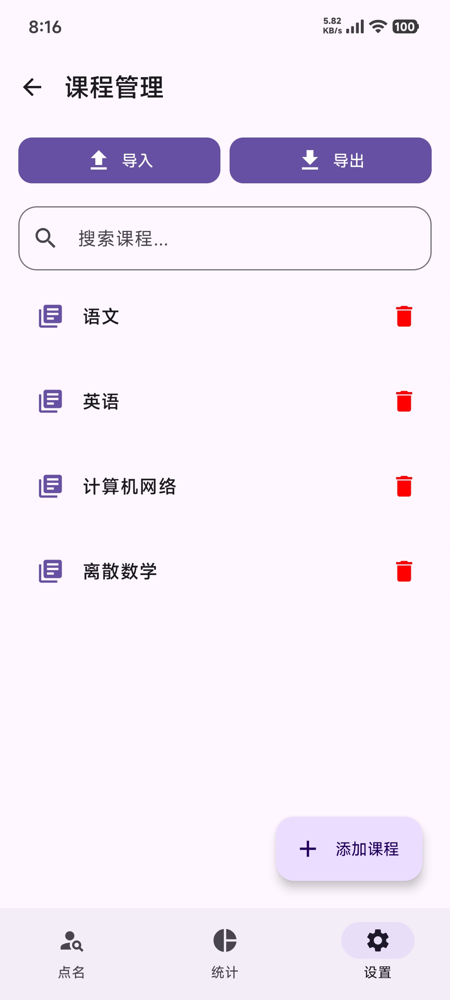
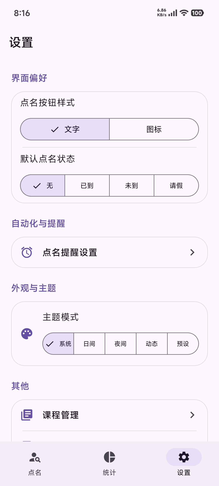
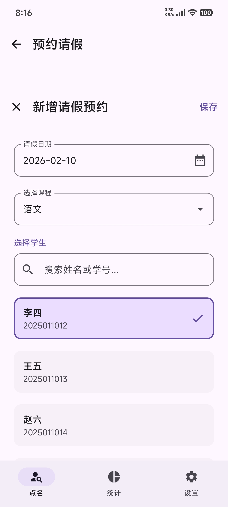
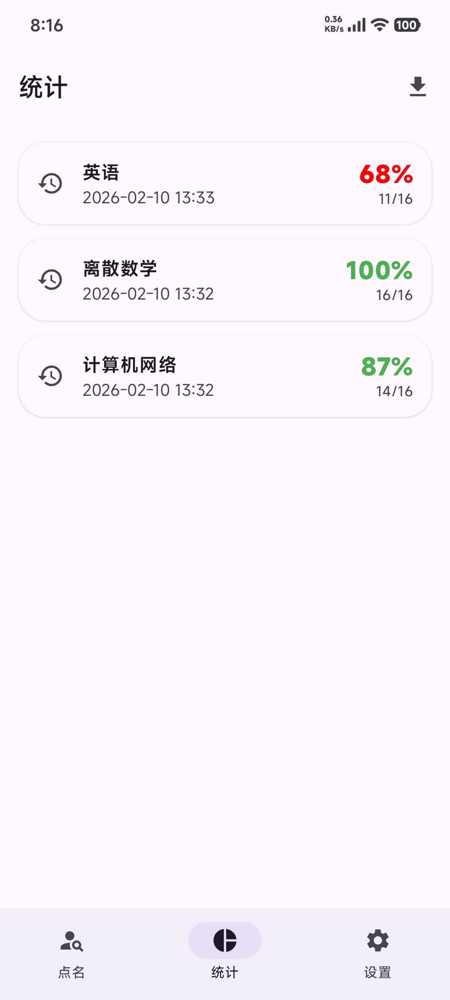
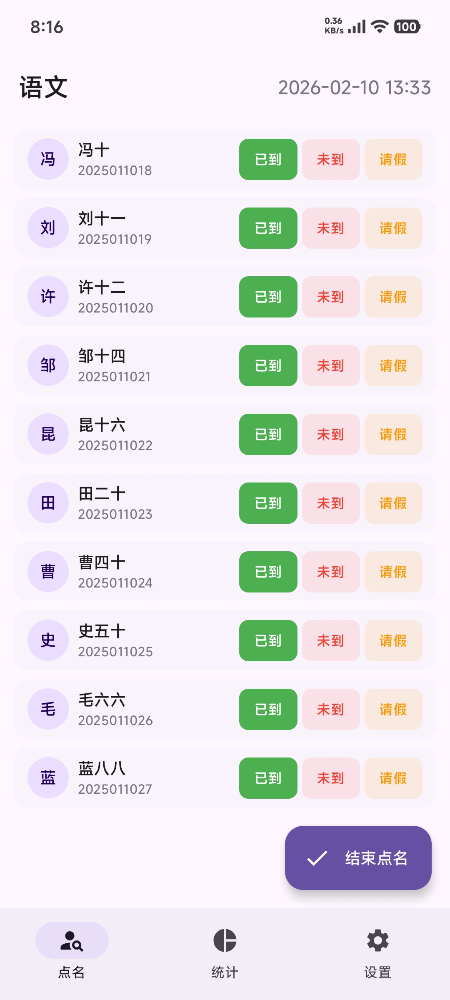
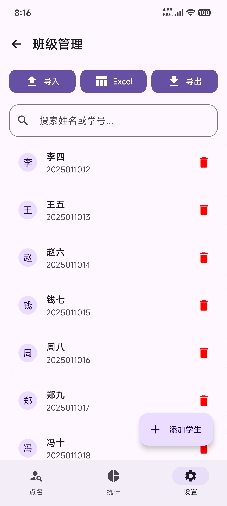

# 点名助手 (RollCallAssistant)

[](https://www.gnu.org/licenses/gpl-3.0.html)
[](https://kotlinlang.org/)
[](https://developer.android.com/jetpack/compose)
[](https://developer.android.com/)

**RollCallAssistant** is a modern, efficient, and aesthetically pleasing attendance management tool for Android. Built with **Jetpack Compose** and **Material 3**, it simplifies the roll-call process for educators and organizers while providing clean data visualization and a seamless user experience.

[English](#english) | [简体中文](#简体中文)

---

## 📱 Preview

|                  课程管理                  |                      设置                      |   请假预约                                 |   结果统计                                 |   考勤界面                                 |     班级管理                                 |
| :----------------------------------------: | :--------------------------------------------: | :----------------------------------------: | :----------------------------------------: | :----------------------------------------: | :----------------------------------------: |
|  |  |  |  |  |  |
|                                            |                                                |                                          |                                          |                                          |                                          |

---

## English

### 🌟 Key Features

-   **🎯 Quick Roll-Call**: Start a session in seconds with customizable default statuses.
-   **💾 Data Persistence**: Full **Room Database** integration for local data storage and management.
-   **📊 Statistics & Data Visualization**: View attendance rates per course/session with detailed breakdowns.
-   **📅 Leave Management**: Pre-register student leave requests to automatically skip them during sessions.
-   **🎨 Personalization**: 
    -   Multiple preset themes (Deep Sea, Forest, Sunset, etc.).
    -   Dynamic color support (**Material You**).
    -   Customizable button styles (Text/Icon).
-   **🔔 Automation**: Reminder settings to ensure you never miss a roll-call.
-   **📤 Easy Export**: One-click preview and clipboard copy of attendance reports.
-   **📱 Modern Navigation**: Support for Material 3 adaptive UI and Android's Predictive Back gesture.

### 🛠 Tech Stack

-   **Language**: [Kotlin](https://kotlinlang.org/)
-   **UI Framework**: [Jetpack Compose](https://developer.android.com/jetpack/compose)
-   **Design System**: [Material Design 3](https://m3.material.io/)
-   **Database**: [Room](https://developer.android.com/training/data-storage/room)
-   **Architecture**: MVVM (ViewModel + Repository)
-   **Min SDK**: 31 (Android 12)
-   **Target SDK**: 36

### 🚀 Getting Started

1.  **Clone the repository**:
    ```bash
    git clone https://github.com/qiaoshengix/RollCallAssistant.git
    ```
2.  **Open in Android Studio**: Recommended Ladybug or newer for best Compose support.
3.  **Build & Run**: Simply hit the "Run" button to deploy to your emulator or device.

---

## 简体中文

### 🌟 核心功能

-   **🎯 快速点名**: 秒级开启点名会话，支持设置默认考勤状态。
-   **💾 数据持久化**: 集成 **Room 数据库**，确保点名记录与学生数据本地安全存储。
-   **📊 统计与可视化**: 查看每门课程/每次点名的出勤率，包含详尽的状态分布。
-   **📅 请假管理**: 提前登记学生请假信息，点名时自动同步状态。
-   **🎨 个性化定制**:
    -   多种预设主题（深海蓝、森野绿、落日橙等）。
    -   支持 **动态色彩 (Material You)**。
    -   可自定义按钮样式（文字或图标）。
-   **🔔 智能提醒**: 设置点名提醒任务，确保考勤准时高效。
-   **📤 数据导出**: 一键预览点名报告并快速复制至剪切板。
-   **📱 现代交互**: 全面适配 Material 3 规范与 Android 预测性返回手势。

### 🛠 技术栈

-   **编程语言**: [Kotlin](https://kotlinlang.org/)
-   **UI 框架**: [Jetpack Compose](https://developer.android.com/jetpack/compose)
-   **设计规范**: [Material Design 3](https://m3.material.io/)
-   **数据持久化**: [Room Persistence Library](https://developer.android.com/training/data-storage/room)
-   **架构模式**: 模块化 UI 与数据分离（已预留 ViewModel 接入点）。
-   **最低支持**: Android 12 (API 31)

### 🚀 快速上手

1.  **克隆仓库**:
    ```bash
    git clone https://github.com/qiaoshengix/RollCallAssistant.git
    ```
2.  **Android Studio 打开**: 建议使用最新版本以获得最佳开发体验。
3.  **编译运行**: 直接点击 "Run" 即可安装。

---

## 🗺 Roadmap (Future Features)

-   [ ] **Connectivity**: Backend service integration for multi-device sync.
-   [ ] **Automation**: SMS/Message auto-parsing for leave requests.
-   [ ] **Import/Export**: Support for CSV/Excel batch student import.
-   [ ] **Analytics**: Advanced attendance trends and student health scoring.

## 🤝 Contributing

Contributions are what make the open-source community such an amazing place to learn, inspire, and create. Any contributions you make are **greatly appreciated**.

1. Fork the Project
2. Create your Feature Branch (`git checkout -b feature/AmazingFeature`)
3. Commit your Changes (`git commit -m 'Add some AmazingFeature'`)
4. Push to the Branch (`git push origin feature/AmazingFeature`)
5. Open a Pull Request

## 📄 License

Distributed under the **GPL-3.0 License**. See `LICENSE` for more information.

---
*Made with ❤️ by [qiaoshengix](https://github.com/qiaoshengix)*
